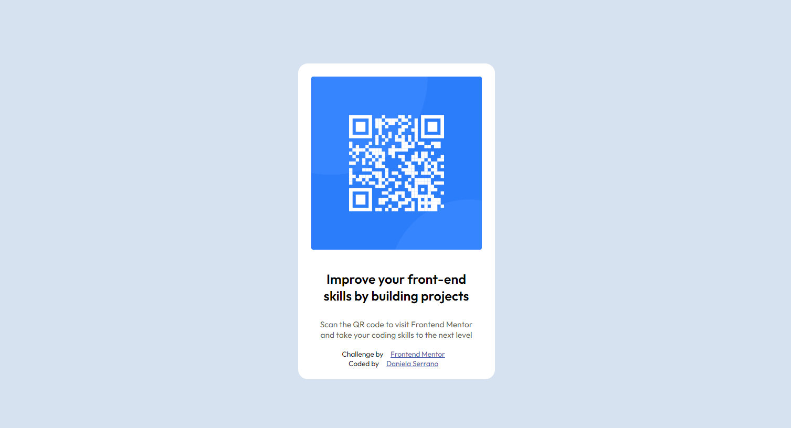

# Frontend Mentor - QR code component solution

This is a solution to the [QR code component challenge on Frontend Mentor](https://www.frontendmentor.io/challenges/qr-code-component-iux_sIO_H). Frontend Mentor challenges help you improve your coding skills by building realistic projects. 

## Table of contents

- [Overview](#overview)
  - [Screenshot](#screenshot)
- [My process](#my-process)
  - [Built with](#built-with)
  - [What I learned](#what-i-learned)
  - [Continued development](#continued-development)
  - [Useful resources](#useful-resources)
- [Author](#author)
- [Acknowledgments](#acknowledgments)

## Overview

### Screenshot



## My process

### Built with

- Semantic HTML5 markup
- CSS custom properties
- CSS Grid
- Mobile-first workflow

### What I learned

While working through this project I could learn more about CSS custom properties and how to organize better my code.


```html
<title>Frontend Mentor | QR code component</title>
```
```css
@media screen and (max-width: 768px) {
    .container {
        margin: 15% auto;
    }
}
```

### Continued development

I want to continue focusing in learn more about styling and structure for the code. Also implementing funcionality adding pogramming language and frameworks as React.

### Useful resources

- [Example resource 1](https://codepen.io/Laurie312/pen/PoKrYLg) - This helped as a style guide. I really liked this pattern and will use it going forward.
- [Example resource 2](https://docs.github.com/es/pages/quickstart) - This is an amazing article which helped me to undesrtand how I can public a webside easily. I'd recommend it to anyone still learning that.

## Author

- Website - [Daniela Serrano](https://github.com/danielaser/qr-code-component)
- Frontend Mentor - [@danielaser](https://www.frontendmentor.io/profile/danielaser)

## Acknowledgments

As a junior developer I find a good documentation and examples that can help everyone who wants to build or add components to a project. There are many sides that can help us to find solutions and to use better programming practices (#useful-resources). 
